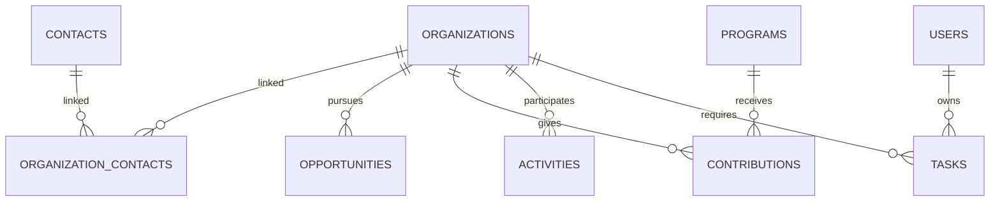

# Conceptual ERD (not final)

```mermaid
erDiagram
  ORGANIZATIONS ||--o{ ORGANIZATION_CONTACTS : linked
  CONTACTS ||--o{ ORGANIZATION_CONTACTS : linked
  ORGANIZATIONS ||--o{ OPPORTUNITIES : pursues
  ORGANIZATIONS ||--o{ CONTRIBUTIONS : gives
  ORGANIZATIONS ||--o{ ACTIVITIES : participates
  ORGANIZATIONS ||--o{ TASKS : requires
  USERS ||--o{ TASKS : owns
  PROGRAMS ||--o{ CONTRIBUTIONS : receives
```
Open: installment payments, agreements, contact affiliations, task-to-activity relations, retention and audit logs. Validate with CBC before physical migrations.
